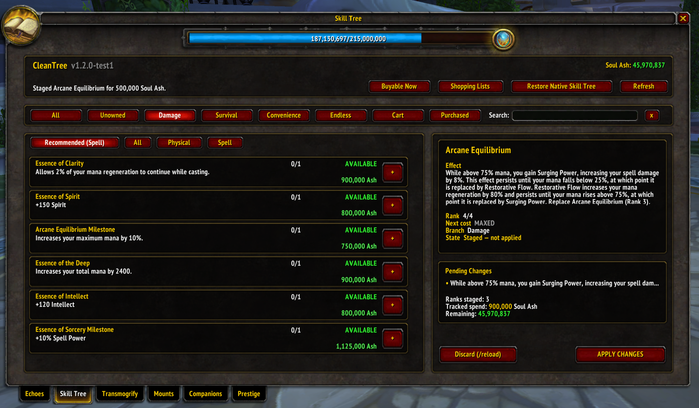
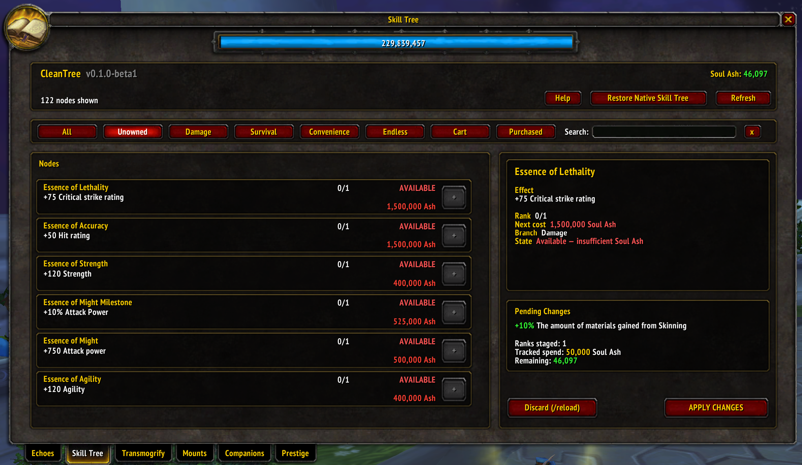
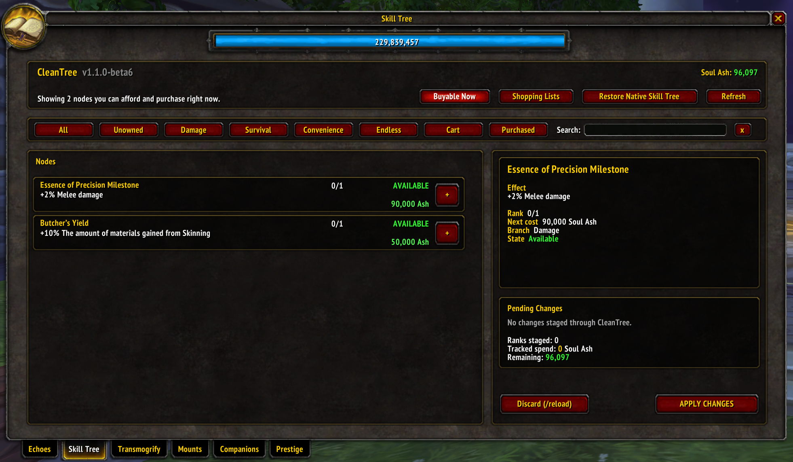
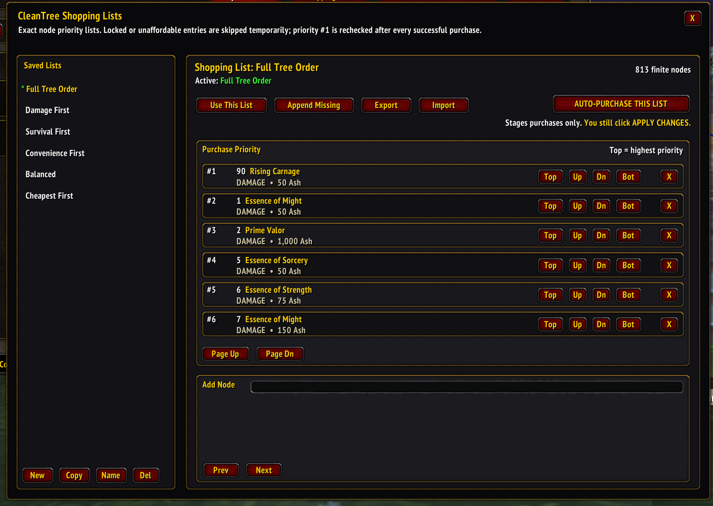
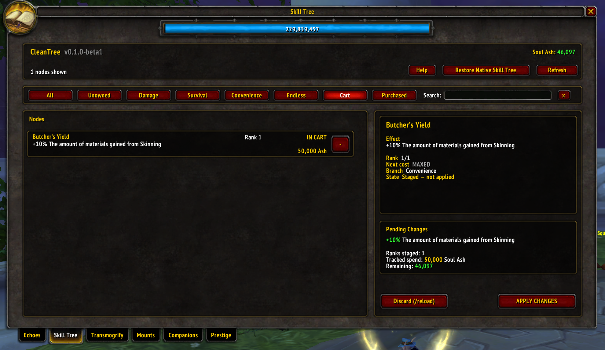
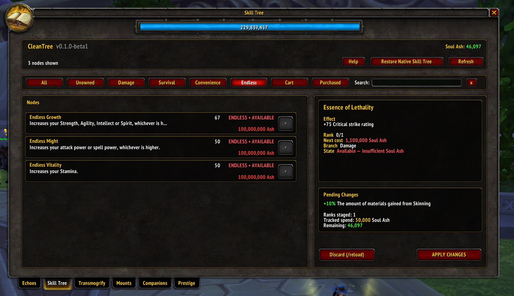
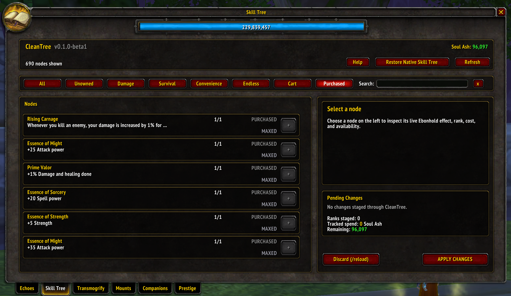

# 🌳 CleanTree

A cleaner, faster way to use Project Ebonhold's Soul Ash Skill Tree.

Project Ebonhold's Skill Tree is enormous. CleanTree keeps the real Ebonhold tree and server logic underneath, but replaces the giant graph with a compact list/detail interface built directly into the native Progression window.

Browse what is available, find exactly what you can afford, stage purchases, review the cart, build reusable Shopping Lists, share those lists with other players, and let CleanTree stage an optimized purchase path for you — without giving up the native **Apply Changes** confirmation.

<p align="center">
  
</p>

---

## Table of Contents

- [🔥 Why CleanTree](#-why-cleantree)
- [✨ Features](#-features)
- [🚀 Quick start](#-quick-start)
- [🧭 Views](#-views)
- [💸 Buyable Now](#-buyable-now)
- [📝 Shopping Lists](#-shopping-lists)
- [🤖 Auto Purchase](#-auto-purchase)
- [📤 Sharing lists](#-sharing-lists)
- [🛒 Purchasing and Cart](#-purchasing-and-cart)
- [♾️ Endless nodes](#️-endless-nodes)
- [↔️ Native Skill Tree coexistence](#️-native-skill-tree-coexistence)
- [📸 Screenshots](#-screenshots)
- [📋 Requirements](#-requirements)
- [💾 Installation](#-installation)
- [⌨️ Commands](#️-commands)
- [🧱 Code anatomy](#-code-anatomy)
- [📜 License](#-license)
- [🙏 Credits](#-credits)

---

## 🔥 Why CleanTree

The native Ebonhold Soul Ash Skill Tree contains hundreds of nodes spread across a very large visual graph. Finding a specific effect, figuring out what is unlocked, deciding what is affordable, and planning hundreds of purchases can take longer than the purchases themselves.

CleanTree presents the same live tree as a stable, searchable interface while leaving Project Ebonhold authoritative for the actual Skill Tree state.

It is **not a second simulated tree**. CleanTree uses EbonAPI and the native Ebonhold Skill Tree underneath for prerequisites, live ranks, Soul Ash, staged purchases, committed purchases, and Apply Changes.

## ✨ Features

| | |
|---|---|
| 🧭 | Browse **All**, **Unowned**, **Damage**, **Survival**, **Convenience**, **Endless**, **Cart**, and **Purchased** views |
| ⚔️ | **Damage → Recommended** detects the current class/spec and focuses on General + Physical or General + Spell while keeping All/Physical/Spell overrides available |
| 💸 | One-click **Buyable Now** view showing only nodes that are unlocked **and** currently affordable |
| 🔎 | Search nodes by name and discovered effect text |
| 🔗 | Order finite nodes by the real prerequisite graph so a node never appears before its prerequisites |
| 🚦 | Distinguish prerequisite-locked nodes from nodes that are merely unaffordable |
| 💰 | Show live Soul Ash state and stage purchases through Ebonhold's native Skill Tree |
| 📝 | Create exact ordered **Shopping Lists** for the way *you* want to build the tree |
| 📤 | Export a Shopping List to one compact string and import lists shared by other players |
| 🤖 | Auto Purchase walks a Shopping List, skips temporarily blocked entries, and keeps re-checking higher priorities |
| 🛑 | Auto Purchase **never applies changes for you** — it stops with purchases staged and waits for your review |
| 🛒 | Review staged ranks in Cart with an aggregated **Purchase Summary**, then remove individual staged ranks through the native right-click path |
| ✅ | Apply through Project Ebonhold's native **Apply Changes** operation |
| 🧾 | Distinguish server-committed purchases from changes staged only in the current tree |
| ♾️ | Include all three Endless nodes as repeatable multi-rank purchases |
| ↔️ | Switch between **CleanTree** and the original Ebonhold Skill Tree at any time |
| 🧪 | Keep diagnostic commands available for EbonAPI/native-tree troubleshooting |

## 🚀 Quick start

1. Open **Progression → Skill Tree** normally.
2. Use **Unowned** for normal browsing, **Buyable Now** to see what you can afford immediately, or choose a branch tab.
3. Click a node to inspect its effect, rank, next cost, prerequisite state, and purchase state.
4. Press `+` to stage a rank manually, or open **Shopping Lists** to plan an ordered build.
5. Review staged purchases in **Cart**.
6. Click **Apply Changes** when you are satisfied with the staged tree.

Availability and affordability are intentionally separate:

- **NOT AVAILABLE** means the real prerequisite requirements are not satisfied.
- **AVAILABLE** but unaffordable means the prerequisites are satisfied, but there is not enough Soul Ash for the next rank.
- **AVAILABLE** and affordable means the rank can be staged now.

## 🧭 Views

| View | Purpose |
|---|---|
| **All** | Every discovered node, including purchased nodes |
| **Unowned** | The normal working list of unfinished finite nodes |
| **Damage** | Unfinished nodes under Rising Carnage. Recommended automatically shows General + the current spec's Physical or Spell leg; All/Physical/Spell remain manually selectable |
| **Survival** | Unfinished nodes under Essence of Endurance |
| **Convenience** | Unfinished nodes under Unshaken |
| **Endless** | Endless Vitality, Endless Might, and Endless Growth |
| **Cart** | Ranks staged in the native tree but not yet committed |
| **Purchased** | Server-committed ranks reported by EbonAPI |

Normal list order is stable. CleanTree does not shuffle the main tree around merely because a node becomes affordable or available; state and button styling communicate what can be done now.

## 💸 Buyable Now

**Buyable Now** is the answer to one simple question:

> What can I actually purchase right now?

The view only shows nodes whose real prerequisites are satisfied **and** whose next rank fits within the player's current live Soul Ash balance.

It recalculates after staged purchases. When buying one node unlocks another, or spending Soul Ash makes something else unaffordable, the list updates to match the new state.

Unlike Shopping Lists, **Buyable Now can include Endless nodes** when their next rank is genuinely available and affordable.

## 📝 Shopping Lists

Shopping Lists are exact, player-controlled purchase priorities for the finite Skill Tree.

CleanTree includes several starter lists:

- **Full Tree Order** — follows CleanTree's prerequisite-safe tree order.
- **Damage First** — adapts to the current class/spec, prioritizing General + the relevant Physical or Spell leg while preserving prerequisites and moving the off-spec Damage leg later rather than deleting it.
- **Survival First** — prioritizes Survival first.
- **Convenience First** — prioritizes Convenience first.
- **Balanced** — spreads priority across the three finite branches.
- **Cheapest First** — favors lower-cost purchases while still respecting live prerequisites during purchase.

You can also build your own lists. Create, copy, rename, or delete a list; search for a node and add it; then move entries to the **Top**, **Up**, **Down**, or **Bottom** until the priority is exactly what you want.

**Append Missing** fills in any finite nodes not already present, making it easy to create a complete build by moving only your important priorities to the top and leaving the rest of the tree afterward.

Shopping Lists use **real node IDs**, not node names. That avoids ambiguity when multiple Ebonhold nodes/ranks share the same display name.

### Why Endless is not in Shopping Lists

The three Endless nodes are intentionally excluded from normal Shopping Lists. They are infinite sinks, so including them in a shared finite build could unexpectedly consume every remaining chunk of Soul Ash once the finite priorities are exhausted.

Endless remains fully supported through the regular **Endless** and **Buyable Now** views.

## 🤖 Auto Purchase

Select a Shopping List and click **AUTO-PURCHASE THIS LIST**.

CleanTree stages purchases through the real native Ebonhold Skill Tree. It does **not** blindly walk from line 1 downward and stop at the first blocked item. Instead, the list acts like a live priority queue:

1. Start with priority #1.
2. If an entry is already complete, locked behind prerequisites, or currently unaffordable, skip it temporarily.
3. Find the highest-priority entry that can actually be purchased now.
4. Stage that purchase through the native Skill Tree.
5. Re-read the live state and start again from priority #1.
6. Stop when no additional Shopping List purchase can currently be staged.

That means a lower-priority prerequisite can be bought first when necessary, then the higher-priority target is reconsidered immediately afterward.

### CleanTree never presses Apply Changes

Auto Purchase only **stages** changes. When it finishes, review **Cart** and click **Apply Changes** yourself.

This is deliberate. The server's native Apply operation remains the final confirmation and authority for committed Skill Tree state.

## 📤 Sharing lists

Any Shopping List can be exported as a single versioned string beginning with:

```text
CTSL1:
```

The export contains the Shopping List name and the exact ordered node IDs in a compact format. A complete finite-tree list is small enough to share as a single Discord message.

To use someone else's list:

1. Copy their full `CTSL1:...` string.
2. Open **Shopping Lists → Import**.
3. Paste the string into the clearly marked import box.
4. Click **Import**.
5. The imported Shopping List is immediately created and selected.

The format is versioned so CleanTree can evolve future list formats without silently misreading older shared builds.

## 🛒 Purchasing and Cart

CleanTree is a replacement presentation layer, not a separate Skill Tree simulator.

A manual `+` click or Shopping List Auto Purchase stages the corresponding **live native node**. Cart removal uses the native tree's staged-removal behavior when available. **Apply Changes** invokes Project Ebonhold's native apply path, so the server remains authoritative for the final committed result.

While **Cart** is selected, the right panel becomes **PURCHASE SUMMARY**. Compatible staged stat gains are normalized and summed, while flat values, percentages, and ratings remain separate. Conditional, proc, immunity, and other non-additive effects remain visible under **Other Effects** instead of being mathematically misrepresented. If native changes exist that CleanTree did not stage and cannot identify precisely, they are explicitly excluded from the benefit totals.

`Discard (/reload)` remains available as a safe fallback for abandoning staged changes when a reliable native full-reset path is not available.

## ♾️ Endless nodes

CleanTree intentionally includes the three infinite nodes:

- `2000` — Endless Vitality
- `2001` — Endless Might
- `2002` — Endless Growth

Endless nodes are not treated as ordinary 0/1 nodes. Each `+` click stages one additional rank, the current rank is read from the live native tree state, and the next cost is calculated from EbonAPI's Talent Database data with the live high-rank cost behavior respected.

They are available through the **Endless** tab and can appear in **Buyable Now**, but they are deliberately excluded from normal Shopping Lists.

## ↔️ Native Skill Tree coexistence

CleanTree deliberately keeps an escape hatch to the stock Ebonhold interface:

- In CleanTree, click **Restore Native Skill Tree**.
- In native mode, click **Restore CleanTree UI** to switch back.

Your current choice is preserved while moving between Progression tabs and reopening the Skill Tree.

## 📸 Screenshots

### ⚔️ Class/spec-aware Damage browsing

**Damage → Recommended** detects the current character's class and active talent spec. It shows General Damage plus the relevant Physical or Spell leg by default, with manual **All**, **Physical**, and **Spell** views always available.


### 🧭 Browse unowned nodes

CleanTree turns the native visual graph into a stable, searchable list while preserving the real Ebonhold prerequisite and purchase state underneath.



### 💸 See what you can buy right now

**Buyable Now** removes the guesswork and shows only nodes whose prerequisites are satisfied and whose next rank fits within your current Soul Ash balance.



### 📝 Build and share Shopping Lists

Create exact purchase priorities, start from built-in strategies, reorder individual nodes, and export the whole list as a single shareable `CTSL1` string.



### 🛒 Stage and review purchases

Purchases are staged through the native Skill Tree system and collected in **Cart** before being committed with **Apply Changes**. The Cart now summarizes additive staged benefits and keeps unusual/conditional effects visible separately.



### ♾️ Endless nodes

CleanTree includes Ebonhold's three repeatable Endless nodes and displays their live rank and next-rank cost.



### ✅ Purchased nodes

The **Purchased** view shows server-committed ranks reported through EbonAPI.



## 📋 Requirements

| | |
|---|---|
| Game | World of Warcraft 3.3.5a on Project Ebonhold |
| Integration | ProjectEbonhold, included with the Ebonhold client |
| Required addon | [EbonAPI](https://github.com/Siphelis/EbonAPI) 2.1.0+ — installed separately; CleanTree does not bundle it |

`SkillTreeAutoLoad` is **not** required. CleanTree and SkillTreeAutoLoad can coexist because both consume the shared EbonAPI integration layer independently.

## 💾 Installation

1. Download the latest `CleanTree-vX.Y.Z.zip` from the [Releases page](https://github.com/StabbyMcStaber/CleanTree/releases/latest).
2. Install [EbonAPI](https://github.com/Siphelis/EbonAPI/releases/latest) if it is not already installed.
3. Extract the `CleanTree` folder into your Ebonhold client's `Interface/AddOns/` folder.
4. Restart the game and make sure **EbonAPI** and **CleanTree** are enabled in the AddOns list.
5. Open **Progression → Skill Tree** normally. CleanTree replaces the Skill Tree content area automatically.

> CleanTree does not use `/cleantree` as a launcher. Open the Skill Tree normally through Project Ebonhold's Progression window.

## ⌨️ Commands

CleanTree normally appears by opening **Progression → Skill Tree**. `/cleantree` by itself is intentionally silent; the slash command exists primarily for helper and diagnostic subcommands.

Useful commands include:

```text
/cleantree show
/cleantree native
/cleantree refresh
/cleantree probe
/cleantree orderprobe
/cleantree graphprobe <node name>
/cleantree apiprobe
/cleantree damageprobe
/cleantree cartprobe
/cleantree shoppingprobe
/cleantree auto
/cleantree apply
```

Diagnostic commands are intentionally retained so Ebonhold/EbonAPI changes can be investigated without requiring a special debug build.

## 🧱 Code anatomy

```text
CleanTree/
├── CleanTree.toc       addon metadata, dependencies, load order
├── EbonTree_Data.lua   captured finite-tree fallback/catalog data
├── EbonTree_Order.lua  stable prerequisite ordering snapshot
├── EbonTree_API.lua    EbonAPI integration layer
├── EbonTree.lua        UI, Shopping Lists, purchasing, cart, diagnostics
└── README.txt          in-addon release/development notes
```

Some internal filenames and symbols still use the project's earlier `EbonTree` name. That is intentional and does not change the installed addon folder/name: **CleanTree**.

## 📜 License

CleanTree is free for noncommercial use and is published under the [PolyForm Strict License 1.0.0](LICENSE.md). You may use the addon for permitted noncommercial purposes, but modification and redistribution are restricted by that license.

## 🙏 Credits

Addon by **Stan**, built with **CarolJean**.

Built for [Project Ebonhold](https://project-ebonhold.com/) and designed around the shared [EbonAPI](https://github.com/Siphelis/EbonAPI) integration layer.

[SkillTreeAutoLoad](https://github.com/Siphelis/SkillTreeAutoLoad) was used as a reference for EbonAPI consumption and native Skill Tree integration. It is not a CleanTree dependency and no SkillTreeAutoLoad source is bundled with CleanTree.